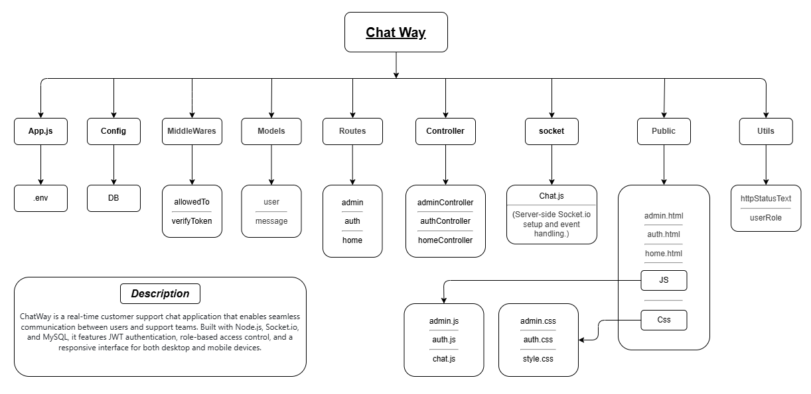

# 💬 ChatWay

A real-time customer support chat application built with **Node.js, Express, Socket.io, and MySQL (Sequelize)**.

---

## Features

- **Secure Authentication -** JWT-based login/register system with refresh tokens
- **Real-time Chat -** Instant messaging using Socket.io
- **Role-Based Access -** Separate interfaces for Users and Admins
- **Admin Dashboard -** Manage all user conversations in one place
- **Read Receipts -** Track unread messages automatically
- **Fully Responsive -** Works seamlessly on desktop, tablet, and mobile
- **Modern UI -** Clean, intuitive interface with golden theme
- **Fast & Lightweight -** Optimized performance
- **Typing Indicators -** See when the admin is typing

---

## Demo

- **Live Demo:** https://chatway-production-7e25.up.railway.app/auth/login
- **Test Accounts**
    - **User Account:**
        - Email: saifeldeen1@gmail.com
        - Password: 000000
    - **Admin Account:**
        - Email: saifeldeen409@gmail.com
        - Password: 000000

---

## Tech Stack

- **Backend:** 
    - **Node.js -** JavaScript runtime
    - **Express.js -** Web framework
    - **Socket.io -** Real-time communication
    - **Database:** MySQL (via Sequelize ORM)
    - **Authentication:** JWT (access + refresh), bcrypt
    - **Config & Env:** dotenv
- **Frontend:**
    - **HTML5, CSS3, JavaScript**.
    - **Socket.io Client -** Real-time updates.

---

## Project Structure



---

## Getting Started

1. Clone the repository:
   ```bash
   git clone https://github.com/your-username/chatway.git
   cd ShopWay
      
2. Install dependencies:
   ```bash
   npm install

3. Create a .env file with the following variables:
   ```bash
   # Database Configuration
   DB_HOST=localhost
   DB_USER=root
   DB_PASS=your_password
   DB_NAME=chatway
   DB_PORT=3306
   DB_DIALECT=mysql

   # Server Configuration
   PORT=3000
   
   # JWT keys
   ACCESS_TOKEN=your_long_random_access_secret
   ACCESS_TOKEN_EXP=15m

   REFRESH_TOKEN=your_long_random_refresh_secret
   REFRESH_TOKEN_EXP=10d


4. Start the server:
   ```bash
   npm start

---

## Authentication Flow

- 1.User registers/logs in → Server generates JWT tokens
- 2.**Access Token** (15 min) - Stored in httpOnly cookie
- 3.**Refresh Token** (10 days) - Stored in httpOnly cookie
- 4.When access token expires, refresh token automatically generates new one
- 5.User stays logged in for 10 days without re-authentication

---

## Author

**Saif Eldeen Sobhi**

- LinkedIn: [linkedin.com/in/saif-eldeen-sobhy](https://www.linkedin.com/in/saif-eldeen-sobhy/)  
- Email: saifeldeen409@gmail.com

## Support
If you have any questions or need help, feel free to:
- Open an issue on GitHub
- Email: your-email@example.com